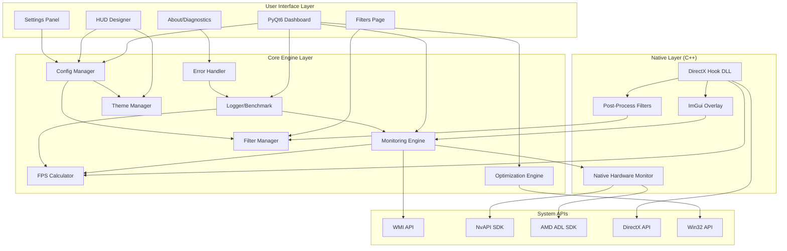

# Design Document

## Overview

GamePP Clone, Windows platformunda çalışan bir sistem izleme ve oyun optimizasyon uygulamasıdır. Uygulama, Python + C++ hibrit mimarisi kullanarak gerçek zamanlı donanım izleme, DirectX hook tabanlı oyun içi overlay, sistem optimizasyonu ve modern bir kullanıcı arayüzü sunar.

### Temel Özellikler
- Gerçek zamanlı CPU, GPU, RAM, SSD ve ağ izleme
- DirectX 9/11/12 hook ile FPS, frame time, 1% low ve 0.1% low ölçümü
- ImGui tabanlı özelleştirilebilir oyun içi overlay
- Tema sistemi ve özel tema oluşturma
- Görsel filtreler (vibrance, sharpening, brightness, contrast)
- Sistem optimizasyonu (servis yönetimi, RAM temizleme, priority ayarlama)
- PyQt6 tabanlı modern dashboard arayüzü
- Benchmark ve CSV loglama sistemi
- Frame drop ve stuttering görselleştirmesi
- Kapsamlı hata yönetimi ve stabilite özellikleri
- Şeffaflık ve güvenlik (açık kaynak, yerel veri depolama)
- Arka plan servis modu

## Architecture



### Katmanlı Mimari

1. **User Interface Layer**: PyQt6 tabanlı kullanıcı arayüzü
2. **Core Engine Layer**: Python ile yazılmış iş mantığı
3. **Native Layer**: C++ ile yazılmış performans kritik bileşenler
4. **System APIs**: Windows ve donanım üreticisi API'leri

## Components and Interfaces

### 1. Monitoring Engine (Python)

```python
class IHardwareMonitor(ABC):
    @abstractmethod
    def get_cpu_metrics(self) -> CPUMetrics: pass
    
    @abstractmethod
    def get_gpu_metrics(self) -> GPUMetrics: pass
    
    @abstractmethod
    def get_memory_metrics(self) -> MemoryMetrics: pass
    
    @abstractmethod
    def get_disk_metrics(self) -> DiskMetrics: pass
    
    @abstractmethod
    def get_network_metrics(self) -> NetworkMetrics: pass

class MonitoringEngine:
    def __init__(self, hardware_monitor: IHardwareMonitor):
        self.hardware_monitor = hardware_monitor
        self.subscribers: List[Callable] = []
        self.polling_interval = 0.5  # seconds
    
    def start(self) -> None: ...
    def stop(self) -> None: ...
    def subscribe(self, callback: Callable[[SystemMetrics], None]) -> None: ...
    def get_current_metrics(self) -> SystemMetrics: ...
```

### 2. DirectX Hook DLL (C++)

```cpp
// IDXHook interface
class IDXHook {
public:
    virtual bool Initialize() = 0;
    virtual void Shutdown() = 0;
    virtual void SetMetrics(const SystemMetrics& metrics) = 0;
    virtual void SetOverlayConfig(const OverlayConfig& config) = 0;
    virtual void SetFilterConfig(const FilterConfig& config) = 0;
    virtual float GetCurrentFPS() = 0;
    virtual float GetFrameTime() = 0;
    virtual FPSPercentiles GetFPSPercentiles() = 0;
};

// DX11Hook implementation
class DX11Hook : public IDXHook {
private:
    ID3D11Device* device;
    ID3D11DeviceContext* context;
    IDXGISwapChain* swapChain;
    std::deque<float> fpsHistory;  // Rolling window of 1000 frames
    ID3D11PixelShader* filterShader;
    
public:
    bool HookPresent();
    void RenderOverlay();
    void ApplyPostProcessingFilters();
    void CalculatePercentileFPS();
    static HRESULT __stdcall PresentHook(IDXGISwapChain* pSwapChain, UINT SyncInterval, UINT Flags);
};
```

### 3. Optimization Engine (Python)

```python
class IOptimizer(ABC):
    @abstractmethod
    def activate_game_mode(self) -> OptimizationResult: pass
    
    @abstractmethod
    def deactivate_game_mode(self) -> OptimizationResult: pass
    
    @abstractmethod
    def get_optimization_status(self) -> OptimizationStatus: pass

class OptimizationEngine(IOptimizer):
    def __init__(self, config: OptimizerConfig):
        self.config = config
        self.original_states: Dict[str, Any] = {}
    
    def terminate_background_processes(self) -> List[str]: ...
    def set_process_priority(self, pid: int, priority: int) -> bool: ...
    def set_timer_resolution(self, resolution_ms: float) -> bool: ...
    def clear_standby_ram(self) -> int: ...  # Returns freed MB
```

### 4. Configuration Manager (Python)

```python
@dataclass
class OverlayConfig:
    font_family: str = "Segoe UI"
    font_size: int = 14
    color: str = "#00FF00"
    position: str = "top-left"  # top-left, top-right, bottom-left, bottom-right, center
    opacity: float = 0.8
    hotkey: str = "F12"
    show_fps: bool = True
    show_cpu: bool = True
    show_gpu: bool = True
    show_ram: bool = True
    show_temps: bool = True
    theme_name: str = "default"

@dataclass
class Theme:
    name: str
    colors: Dict[str, str]  # metric_name -> color
    font_family: str
    font_size: int
    background_color: str
    opacity: float

@dataclass
class FilterConfig:
    vibrance: float = 0.0  # 0-100%
    sharpening: float = 0.0  # 0-100%
    brightness: float = 0.0  # -50 to +50%
    contrast: float = 0.0  # -50 to +50%
    enabled: bool = False

@dataclass
class AppConfig:
    auto_start: bool = False
    minimize_to_tray: bool = True
    overlay: OverlayConfig = field(default_factory=OverlayConfig)
    optimizer: OptimizerConfig = field(default_factory=OptimizerConfig)
    filters: FilterConfig = field(default_factory=FilterConfig)
    logging_enabled: bool = False
    themes: Dict[str, Theme] = field(default_factory=dict)

class ConfigManager:
    def __init__(self, config_path: Path):
        self.config_path = config_path
        self.config: AppConfig = AppConfig()
    
    def load(self) -> AppConfig: ...
    def save(self) -> None: ...
    def reset_to_defaults(self) -> None: ...
    def validate(self) -> List[str]: ...  # Returns validation errors
```

### 5. FPS Calculator (Python)

```python
class FPSCalculator:
    def __init__(self, window_size: int = 1000):
        self.frame_times: deque = deque(maxlen=window_size)
        self.window_size = window_size
    
    def add_frame(self, frame_time: float) -> None: ...
    def get_current_fps(self) -> float: ...
    def get_percentile_fps(self, percentile: float) -> float: ...
    def get_1_percent_low(self) -> float: ...
    def get_0_1_percent_low(self) -> float: ...
    def get_frame_time_avg(self) -> float: ...
```

### 6. Theme Manager (Python)

```python
class ThemeManager:
    def __init__(self, themes_dir: Path):
        self.themes_dir = themes_dir
        self.themes: Dict[str, Theme] = {}
        self.current_theme: Optional[Theme] = None
    
    def load_themes(self) -> None: ...
    def get_theme(self, name: str) -> Optional[Theme]: ...
    def apply_theme(self, theme: Theme) -> OverlayConfig: ...
    def save_custom_theme(self, theme: Theme) -> None: ...
    def export_theme(self, theme: Theme, filepath: Path) -> None: ...
    def import_theme(self, filepath: Path) -> Theme: ...
```

### 7. Filter Manager (Python/C++)

```python
class FilterManager:
    def __init__(self):
        self.current_config: FilterConfig = FilterConfig()
        self.presets: Dict[str, FilterConfig] = {}
    
    def apply_filter_config(self, config: FilterConfig) -> None: ...
    def save_preset(self, name: str, config: FilterConfig) -> None: ...
    def load_preset(self, name: str) -> FilterConfig: ...
    def disable_all_filters(self) -> None: ...
    def validate_filter_values(self, config: FilterConfig) -> List[str]: ...
```

### 8. Error Handler (Python)

```python
class ErrorHandler:
    def __init__(self, log_dir: Path):
        self.log_dir = log_dir
        self.error_logs: List[ErrorLog] = []
        self.blacklist: Set[str] = set()
    
    def log_error(self, context: str, message: str, level: str = "ERROR") -> None: ...
    def log_injection_attempt(self, attempt: InjectionAttempt) -> None: ...
    def add_to_blacklist(self, process_name: str) -> None: ...
    def is_blacklisted(self, process_name: str) -> bool: ...
    def export_diagnostics(self, filepath: Path) -> None: ...
    def generate_crash_dump(self) -> Path: ...
```

### 9. Logger/Benchmark System (Python)

```python
@dataclass
class LogEntry:
    timestamp: datetime
    fps: float
    frame_time: float
    fps_1_percent_low: float
    fps_0_1_percent_low: float
    cpu_usage: float
    cpu_temp: float
    gpu_usage: float
    gpu_temp: float
    ram_usage: int
    vram_usage: int

class BenchmarkLogger:
    def __init__(self, output_dir: Path):
        self.output_dir = output_dir
        self.entries: List[LogEntry] = []
        self.session_start: Optional[datetime] = None
    
    def start_session(self) -> None: ...
    def log_entry(self, metrics: SystemMetrics, fps: float, frame_time: float, percentiles: FPSPercentiles) -> None: ...
    def end_session(self) -> BenchmarkResult: ...
    def export_csv(self, filepath: Path) -> None: ...
    def get_statistics(self) -> BenchmarkStatistics: ...
    def detect_frame_drops(self, threshold: float = 0.5) -> List[int]: ...
```

### 6. UI Components (PyQt6)

```python
class MainWindow(QMainWindow):
    def __init__(self):
        self.dashboard_page: DashboardPage
        self.overlay_editor_page: OverlayEditorPage
        self.system_monitor_page: SystemMonitorPage
        self.optimizer_page: OptimizerPage
        self.settings_page: SettingsPage
        self.filters_page: FiltersPage
        self.about_page: AboutPage
        self.tray_icon: QSystemTrayIcon

class DashboardPage(QWidget):
    def __init__(self, monitoring_engine: MonitoringEngine):
        self.cpu_graph: MetricGraph
        self.gpu_graph: MetricGraph
        self.fps_graph: MetricGraph
        self.metric_cards: List[MetricCard]
    
    def update_metrics(self, metrics: SystemMetrics) -> None: ...
    def highlight_frame_drops(self, fps_data: List[float]) -> None: ...

class OverlayEditorPage(QWidget):
    def __init__(self, config_manager: ConfigManager):
        self.font_selector: QFontComboBox
        self.color_picker: QColorDialog
        self.position_selector: QComboBox
        self.opacity_slider: QSlider
        self.theme_selector: QComboBox
        self.theme_editor: ThemeEditor
        self.preview_widget: OverlayPreview
    
    def apply_changes(self) -> None: ...
    def preview_changes(self) -> None: ...
    def save_custom_theme(self, theme: Theme) -> None: ...
    def load_theme(self, theme_name: str) -> None: ...

class FiltersPage(QWidget):
    def __init__(self, config_manager: ConfigManager):
        self.vibrance_slider: QSlider
        self.sharpening_slider: QSlider
        self.brightness_slider: QSlider
        self.contrast_slider: QSlider
        self.preset_selector: QComboBox
    
    def apply_filters(self) -> None: ...
    def save_preset(self, name: str) -> None: ...
    def disable_filters(self) -> None: ...

class AboutPage(QWidget):
    def __init__(self):
        self.license_text: QTextEdit
        self.repo_link: QLabel
        self.active_hooks_list: QListWidget
    
    def show_active_hooks(self) -> None: ...
    def export_diagnostics(self) -> None: ...
```

## Data Models

### System Metrics

```python
@dataclass
class CPUMetrics:
    usage_percent: float
    temperature: float
    core_count: int
    frequency_mhz: int

@dataclass
class GPUMetrics:
    usage_percent: float
    temperature: float
    vram_used_mb: int
    vram_total_mb: int
    name: str

@dataclass
class MemoryMetrics:
    used_mb: int
    total_mb: int
    usage_percent: float

@dataclass
class DiskMetrics:
    temperature: float
    name: str

@dataclass
class NetworkMetrics:
    ping_ms: float
    upload_kbps: float
    download_kbps: float

@dataclass
class SystemMetrics:
    timestamp: datetime
    cpu: CPUMetrics
    gpu: GPUMetrics
    memory: MemoryMetrics
    disk: DiskMetrics
    network: NetworkMetrics
```

### Configuration Models

```python
@dataclass
class OptimizerConfig:
    processes_to_terminate: List[str] = field(default_factory=lambda: [
        "OneDrive.exe", "Cortana.exe", "SearchUI.exe"
    ])
    set_high_priority: bool = True
    clear_ram: bool = True
    set_timer_resolution: bool = True
    timer_resolution_ms: float = 0.5

@dataclass
class OptimizationResult:
    success: bool
    terminated_processes: List[str]
    freed_ram_mb: int
    errors: List[str]

@dataclass
class FPSPercentiles:
    fps_1_percent_low: float
    fps_0_1_percent_low: float

@dataclass
class BenchmarkStatistics:
    min_fps: float
    max_fps: float
    avg_fps: float
    fps_1_percent_low: float
    fps_0_1_percent_low: float
    avg_frame_time: float
    duration_seconds: float
    total_frames: int
    frame_drops: List[int]  # Frame indices where drops occurred

@dataclass
class ErrorLog:
    timestamp: datetime
    level: str  # ERROR, WARNING, INFO
    context: str
    message: str
    stack_trace: Optional[str]

@dataclass
class InjectionAttempt:
    process_name: str
    attempt_number: int
    success: bool
    error_message: Optional[str]
    timestamp: datetime
```

## File Structure

```
gamepp-clone/
├── src/
│   ├── core/
│   │   ├── __init__.py
│   │   ├── monitoring.py      # MonitoringEngine
│   │   ├── optimizer.py       # OptimizationEngine
│   │   ├── logger.py          # BenchmarkLogger
│   │   ├── config.py          # ConfigManager
│   │   ├── fps_calculator.py  # FPSCalculator
│   │   ├── theme_manager.py   # ThemeManager
│   │   ├── filter_manager.py  # FilterManager
│   │   ├── error_handler.py   # ErrorHandler
│   │   └── game_detector.py   # GameDetector
│   ├── models/
│   │   ├── __init__.py
│   │   ├── metrics.py         # Data models
│   │   ├── config.py          # Config models
│   │   └── errors.py          # Error models
│   ├── hardware/
│   │   ├── __init__.py
│   │   ├── cpu_monitor.py
│   │   ├── gpu_monitor.py
│   │   ├── memory_monitor.py
│   │   ├── disk_monitor.py
│   │   └── network_monitor.py
│   ├── ui/
│   │   ├── __init__.py
│   │   ├── main_window.py
│   │   ├── pages/
│   │   │   ├── dashboard.py
│   │   │   ├── overlay_editor.py
│   │   │   ├── system_monitor.py
│   │   │   ├── optimizer.py
│   │   │   ├── filters.py
│   │   │   ├── about.py
│   │   │   └── settings.py
│   │   ├── widgets/
│   │   │   ├── metric_card.py
│   │   │   ├── metric_graph.py
│   │   │   ├── overlay_preview.py
│   │   │   └── theme_editor.py
│   │   └── styles/
│   │       └── style.qss
│   └── main.py
├── native/
│   ├── CMakeLists.txt
│   ├── src/
│   │   ├── dxhook/
│   │   │   ├── dx11_hook.cpp
│   │   │   ├── dx11_hook.h
│   │   │   ├── dx9_hook.cpp
│   │   │   ├── dx12_hook.cpp
│   │   │   └── hook_manager.cpp
│   │   ├── overlay/
│   │   │   ├── imgui_overlay.cpp
│   │   │   └── imgui_overlay.h
│   │   ├── filters/
│   │   │   ├── post_process.cpp
│   │   │   ├── post_process.h
│   │   │   └── shaders/
│   │   │       ├── vibrance.hlsl
│   │   │       ├── sharpen.hlsl
│   │   │       ├── brightness.hlsl
│   │   │       └── contrast.hlsl
│   │   └── main.cpp
│   └── include/
│       └── exports.h
├── config/
│   ├── default_config.json
│   └── blacklist.json
├── themes/
│   ├── default.json
│   ├── dark.json
│   └── neon.json
├── logs/
├── crash_dumps/
├── tests/
│   ├── unit/
│   │   ├── test_monitoring.py
│   │   ├── test_optimizer.py
│   │   ├── test_logger.py
│   │   ├── test_config.py
│   │   ├── test_fps_calculator.py
│   │   ├── test_theme_manager.py
│   │   ├── test_filter_manager.py
│   │   └── test_error_handler.py
│   ├── property/
│   │   ├── test_metrics_properties.py
│   │   ├── test_config_properties.py
│   │   ├── test_logger_properties.py
│   │   ├── test_optimizer_properties.py
│   │   ├── test_fps_properties.py
│   │   ├── test_theme_properties.py
│   │   ├── test_filter_properties.py
│   │   └── test_error_properties.py
│   └── integration/
│       ├── test_monitoring_integration.py
│       ├── test_config_integration.py
│       └── test_overlay_integration.py
├── requirements.txt
└── README.md
```


## Correctness Properties

*A property is a characteristic or behavior that should hold true across all valid executions of a system-essentially, a formal statement about what the system should do. Properties serve as the bridge between human-readable specifications and machine-verifiable correctness guarantees.*

### Property 1: Metrics Data Structure Validity
*For any* hardware data collected by the monitoring engine, the output SHALL be a valid SystemMetrics object with all required fields (cpu, gpu, memory, disk, network) populated with values in their valid ranges (percentages 0-100, temperatures >= 0, memory values >= 0).
**Validates: Requirements 1.6**

### Property 2: FPS Calculation Correctness
*For any* sequence of frame timestamps, the calculated FPS SHALL equal 1000 divided by the average frame time in milliseconds, and frame time SHALL equal the difference between consecutive timestamps.
**Validates: Requirements 2.2, 2.3**

### Property 3: Percentile FPS Calculation
*For any* sequence of FPS values, the 1% low SHALL be the value at the 1st percentile and 0.1% low SHALL be the value at the 0.1st percentile, where both percentiles are calculated from the sorted FPS values.
**Validates: Requirements 2.4**

### Property 4: Rolling Window Size Constraint
*For any* sequence of frame measurements exceeding 1000 frames, the FPS calculator SHALL maintain exactly 1000 frames in its buffer, discarding the oldest frame when a new one arrives.
**Validates: Requirements 2.5**

### Property 5: Overlay Render Completeness
*For any* SystemMetrics input and OverlayConfig with all display options enabled, the rendered overlay output SHALL contain FPS value, CPU usage, GPU usage, CPU temperature, GPU temperature, and RAM usage.
**Validates: Requirements 3.3**

### Property 6: Config Value Persistence
*For any* valid OverlayConfig value (font, color, position, opacity), setting the value through the config manager SHALL result in the config object containing that exact value.
**Validates: Requirements 4.2, 4.3, 4.4, 4.5**

### Property 7: Theme Application Completeness
*For any* Theme object, applying the theme SHALL set all overlay config values (colors, font_family, font_size, opacity) to match the theme's values.
**Validates: Requirements 4.6**

### Property 8: Theme Save/Load Round-Trip
*For any* valid Theme object, saving to file then loading from file SHALL produce an equivalent Theme object with all values preserved.
**Validates: Requirements 4.9**

### Property 9: Config Save/Load Round-Trip
*For any* valid AppConfig object, saving to file then loading from file SHALL produce an equivalent AppConfig object with all values preserved.
**Validates: Requirements 4.7, 4.8**

### Property 10: Game Mode State Restoration
*For any* system state before game mode activation, activating game mode then deactivating SHALL restore process priorities to their original values.
**Validates: Requirements 5.5**

### Property 11: Optimization Action Logging
*For any* optimization action performed (process termination, priority change, RAM clear), a corresponding log entry SHALL be created containing the action type, target, and result.
**Validates: Requirements 5.6**

### Property 12: Graph History Buffer Size
*For any* sequence of metric updates over time, the graph data buffer SHALL maintain exactly 60 seconds of history, discarding older entries as new ones arrive.
**Validates: Requirements 6.3**

### Property 13: Frame Drop Detection
*For any* FPS sequence containing values that drop below 50% of the average FPS, those frames SHALL be identified and included in the frame_drops list.
**Validates: Requirements 7.6**

### Property 14: Log Entry Completeness
*For any* metrics logged during a session, each LogEntry SHALL contain a valid timestamp, FPS, frame_time, fps_1_percent_low, fps_0_1_percent_low, cpu_usage, cpu_temp, gpu_usage, gpu_temp, ram_usage, and vram_usage.
**Validates: Requirements 7.1**

### Property 15: CSV Export Round-Trip
*For any* list of LogEntry objects, exporting to CSV then parsing the CSV SHALL produce an equivalent list of entries with all values preserved.
**Validates: Requirements 7.2**

### Property 16: Benchmark Statistics Correctness
*For any* non-empty sequence of FPS values, the calculated statistics SHALL satisfy: min_fps <= fps_0_1_percent_low <= fps_1_percent_low <= avg_fps <= max_fps, and avg_fps SHALL equal the arithmetic mean of all values.
**Validates: Requirements 7.3**

### Property 17: Log Filename Timestamp Format
*For any* logging session that ends, the generated filename SHALL contain a valid ISO 8601 timestamp that matches the session end time.
**Validates: Requirements 7.4**

### Property 18: Hotkey Conflict Detection
*For any* hotkey assignment attempt, if the hotkey is already assigned to another function, the validator SHALL return a conflict error and reject the assignment.
**Validates: Requirements 9.2**

### Property 19: Config Reset to Defaults
*For any* modified AppConfig, calling reset_to_defaults() SHALL result in a config object that equals the default AppConfig with all factory default values.
**Validates: Requirements 9.5**

### Property 20: Vibrance Filter Application
*For any* RGB color value and vibrance percentage (0-100%), applying the vibrance filter SHALL increase the color saturation by the specified percentage while preserving hue and brightness.
**Validates: Requirements 10.1**

### Property 21: Brightness Adjustment Range
*For any* RGB color value and brightness adjustment (-50% to +50%), applying the brightness filter SHALL modify all RGB components proportionally within the valid range [0, 255].
**Validates: Requirements 10.3**

### Property 22: Contrast Adjustment Range
*For any* RGB color value and contrast adjustment (-50% to +50%), applying the contrast filter SHALL modify the distance from middle gray (128) by the specified percentage.
**Validates: Requirements 10.4**

### Property 23: Filter Preset Round-Trip
*For any* valid FilterConfig object, saving as a preset then loading the preset SHALL produce an equivalent FilterConfig with all values preserved.
**Validates: Requirements 10.6**

### Property 24: Filter Disable Restoration
*For any* FilterConfig with enabled filters, disabling all filters SHALL set all filter values to their default (0.0) and enabled to false.
**Validates: Requirements 10.7**

### Property 25: Error Log Completeness
*For any* error that occurs, the logged ErrorLog SHALL contain a valid timestamp, level, context, message, and optionally a stack trace.
**Validates: Requirements 11.1**

### Property 26: Injection Retry Logic
*For any* DLL injection failure, the system SHALL attempt exactly 3 retries with exponentially increasing delays (1s, 2s, 4s) before giving up.
**Validates: Requirements 11.3**

### Property 27: Sensor Failure Graceful Degradation
*For any* hardware sensor that fails, the monitoring engine SHALL continue collecting data from all remaining functional sensors without interruption.
**Validates: Requirements 11.4**

### Property 28: Adaptive Update Frequency
*For any* overlay update cycle where FPS drops below 90% of baseline, the update frequency SHALL be automatically reduced by 50%.
**Validates: Requirements 11.7**

### Property 29: Memory Warning Threshold
*For any* monitoring cycle where memory usage exceeds 200MB, a warning SHALL be logged and cached data SHALL be cleared.
**Validates: Requirements 11.8**

### Property 30: Blacklist Management
*For any* game that fails injection 3 times, the game SHALL be added to the blacklist and no further injection attempts SHALL be made on subsequent runs.
**Validates: Requirements 11.9**

### Property 31: Active Hooks Transparency
*For any* request to display active hooks, the displayed list SHALL exactly match the set of currently active DirectX hooks and injected DLLs.
**Validates: Requirements 12.4**

### Property 32: Optimization Transparency
*For any* optimization action that terminates a process, the log SHALL contain the process name and the reason from the configured termination list.
**Validates: Requirements 12.5**

## Error Handling

### Hardware Monitoring Errors
- **Sensor Unavailable**: Return "N/A" for unavailable sensors, continue monitoring others (graceful degradation)
- **WMI Connection Failure**: Retry 3 times with exponential backoff, then fall back to cached values
- **GPU SDK Not Found**: Detect GPU vendor and log warning if SDK unavailable
- **Monitoring Thread Crash**: Restart monitoring thread, log error with stack trace

### DirectX Hook Errors
- **Injection Failure**: Log error with process name and error code, retry up to 3 times with exponential backoff (1s, 2s, 4s)
- **Hook Detach**: Automatically attempt re-hook on next frame
- **Unsupported API**: Detect API type, display "Unsupported: [API Name]" in overlay, add to blacklist
- **Overlay FPS Drop**: Detect when overlay causes >10% FPS drop, automatically reduce update frequency by 50%
- **Shader Compilation Failure**: Disable filters, log error, notify user

### Configuration Errors
- **File Corruption**: Detect invalid JSON, backup corrupted file, reset to defaults, notify user
- **Invalid Values**: Validate on load, clamp values to valid ranges, log warnings
- **Permission Denied**: Request elevated permissions or use user-writable location
- **Theme Load Failure**: Fall back to default theme, log error

### Optimization Errors
- **Process Access Denied**: Skip process, log warning, continue with others
- **Priority Change Failed**: Log error, do not add to restoration list
- **Timer Resolution Failed**: Log warning, continue without timer optimization
- **RAM Clear Failed**: Log error, continue with other optimizations

### Memory Management
- **Memory Threshold Exceeded**: When usage exceeds 200MB, log warning and clear cached data (FPS history, graph buffers)
- **Memory Leak Detection**: Monitor memory growth over time, log warnings if sustained growth detected

### Crash Recovery
- **Application Crash**: Generate crash dump with timestamp, error context, and stack trace
- **Game Crash During Injection**: Detect game crash, add to blacklist if crash occurs within 5 seconds of injection
- **Graceful Shutdown**: On critical error, attempt to unhook all DLLs and restore system state before exit

## Testing Strategy

### Unit Testing Framework
- **Framework**: pytest for Python, Google Test for C++
- **Coverage Target**: Minimum 80% code coverage for core modules
- **Mocking**: Use unittest.mock for hardware interfaces and system calls

### Property-Based Testing
- **Framework**: Hypothesis (Python)
- **Minimum Iterations**: 100 per property test
- **Tag Format**: `**Feature: gamepp-clone, Property {number}: {property_text}**`
- **Strategy**: Generate random valid inputs that cover edge cases (empty lists, boundary values, extreme percentages)

### Test Categories

#### Unit Tests
1. **Monitoring Engine Tests**
   - Test metric collection with mocked hardware interfaces
   - Test subscriber notification mechanism
   - Test polling interval accuracy
   - Test graceful degradation when sensors fail

2. **FPS Calculator Tests**
   - Test rolling window size constraint
   - Test percentile calculations (1%, 0.1%)
   - Test frame time averaging
   - Test buffer overflow handling

3. **Config Manager Tests**
   - Test load/save operations
   - Test validation logic
   - Test default value handling
   - Test corruption recovery

4. **Theme Manager Tests**
   - Test theme loading and application
   - Test custom theme creation
   - Test theme import/export
   - Test theme file validation

5. **Filter Manager Tests**
   - Test filter value validation
   - Test preset save/load
   - Test filter disable/restore
   - Test filter value clamping

6. **Logger Tests**
   - Test log entry creation with percentiles
   - Test CSV export format
   - Test statistics calculation
   - Test frame drop detection

7. **Optimizer Tests**
   - Test process list filtering
   - Test priority change logic
   - Test state restoration
   - Test error handling for access denied

8. **Error Handler Tests**
   - Test error logging with stack traces
   - Test blacklist management
   - Test injection retry logic
   - Test crash dump generation

#### Property-Based Tests
Each correctness property (1-32) will have a corresponding property-based test that:
- Generates random valid inputs using Hypothesis strategies
- Verifies the property holds for all generated inputs
- Tags the test with the property reference
- Runs minimum 100 iterations per test

**Key Property Tests:**
- **Percentile Calculations**: Generate random FPS sequences, verify 1% and 0.1% low calculations
- **Rolling Window**: Generate sequences > 1000 frames, verify buffer size constraint
- **Round-Trip Properties**: Config, theme, filter preset, CSV export
- **Filter Transformations**: Generate random RGB values, verify saturation/brightness/contrast changes
- **Error Handling**: Generate failure scenarios, verify retry logic and graceful degradation
- **Blacklist Management**: Generate injection failures, verify blacklist behavior

#### Integration Tests
1. **End-to-End Monitoring**: Start engine, collect metrics, verify data flow to UI
2. **Config Persistence**: Modify settings, restart app, verify persistence
3. **Optimization Cycle**: Activate game mode, verify changes, deactivate, verify restoration
4. **Overlay Injection**: Inject into test application, verify overlay renders
5. **Filter Pipeline**: Apply filters, verify shader compilation and rendering
6. **Theme Application**: Load theme, verify all UI elements update
7. **Error Recovery**: Simulate errors, verify graceful recovery and logging

### Test File Structure
```
tests/
├── unit/
│   ├── test_monitoring.py
│   ├── test_fps_calculator.py
│   ├── test_config.py
│   ├── test_theme_manager.py
│   ├── test_filter_manager.py
│   ├── test_logger.py
│   ├── test_optimizer.py
│   └── test_error_handler.py
├── property/
│   ├── test_metrics_properties.py
│   ├── test_fps_properties.py
│   ├── test_config_properties.py
│   ├── test_theme_properties.py
│   ├── test_filter_properties.py
│   ├── test_logger_properties.py
│   ├── test_optimizer_properties.py
│   └── test_error_properties.py
└── integration/
    ├── test_monitoring_integration.py
    ├── test_config_integration.py
    ├── test_overlay_integration.py
    └── test_filter_integration.py
```

### Testing Best Practices
- **Isolation**: Each test should be independent and not rely on external state
- **Determinism**: Use fixed seeds for random generators in property tests for reproducibility
- **Performance**: Property tests should complete within 5 seconds
- **Edge Cases**: Explicitly test boundary values (0, 100%, empty lists, single element)
- **Error Injection**: Simulate failures (sensor unavailable, file corruption, access denied)
- **Cleanup**: Ensure all tests clean up resources (files, processes, hooks)
